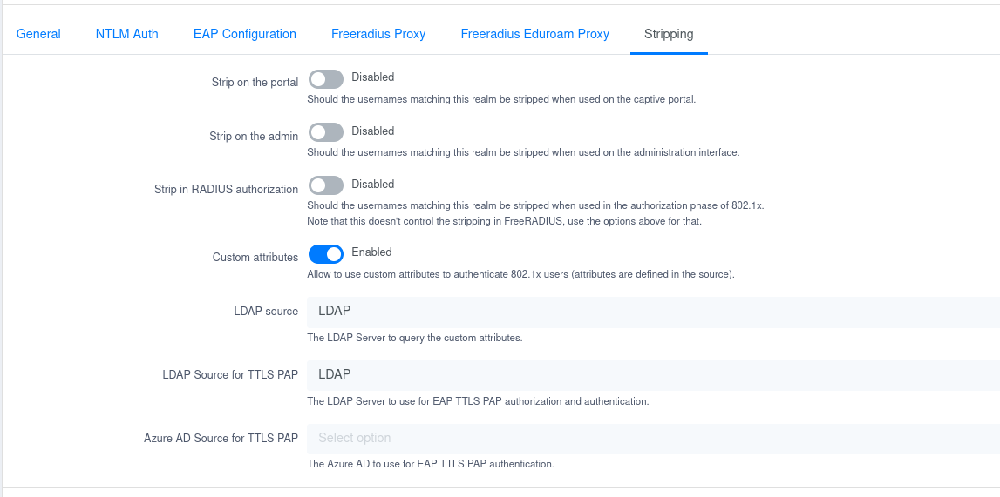

[Packetfence](https://www.packetfence.org/) is an opensource NAC solution which we have been
thinking of to replace the old manual freeradius based solution we have in IIIT. It has good documentation
for setting up [switches](https://www.packetfence.org/doc/PacketFence_Network_Devices_Configuration_Guide.html),
[Installation](https://www.packetfence.org/doc/PacketFence_Installation_Guide.html) etc.

Packetfence has [first party support for Active Directory](https://www.packetfence.org/doc/PacketFence_Installation_Guide.html#_connecting_packetfence_to_microsoft_active_directory) but I don't want to use Active Directory but just run off of the 
389-ds that we are running already as is done in our old setup. This was a project I inherited from a previous sysadmin so I hadn't
gone through the setup myself.

Now, the installation guide has [LDAP described as an authentication source](https://www.packetfence.org/doc/PacketFence_Installation_Guide.html#_authentication_sources)
but adding that doesn't do anything for 802.1x EAP authentication.

Reading the documentation, the [16.3. EAP Authentication against OpenLDAP](https://www.packetfence.org/doc/PacketFence_Installation_Guide.html#_eap_authentication_against_openldap) section asks you to edit the `packetfence-tunnel` file at `/usr/local/pf/raddb/sites-available/packetfence-tunnel`
to add LDAP authentication. But everytime i edit that file and restart the services, it just gets overwritten!

Going through the `/usr/local/pf/` files, i found a seperate `conf` directory. In `radiusd` there, I found a template `packetfence-tunnel` file there, which had the 
`authorize_ldap_choice` variable inside it. Grepping for it, and going through a rabbit hole found out that it is enabled by another variable `permit_custom_attributes`, and that it is set in the realm config itself (lol!) But at a seperate very unintuitive page: 

Under the Stripping section!

Anyways, after setting that, the `packetfence-tunnel` was set properly. 

WIP: test this

Remember:

**EDIT `/usr/local/pf/conf/*` instead of whatever direct config you want to edit like `/usr/local/pf/raddb/sites-available/packetfence-tunnel`**

The documentation needs to be updated.